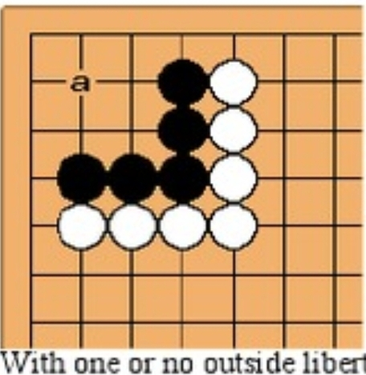

# L001 – Two-Eye Life & Death

**Source:** Beginner tsumego example (illustrative)

**Description:**
Black to play.  
Determine if Black can live by forming two eyes.
If so, where should Black play first?

**Linked experiment:**
(issue template link)
